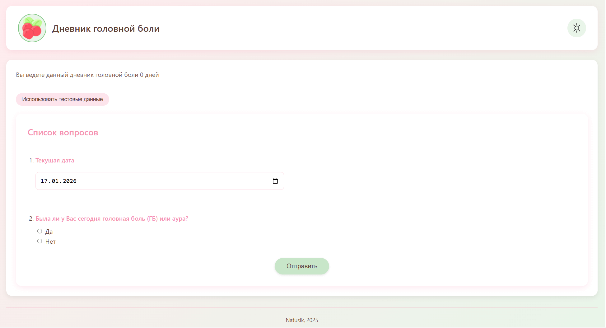
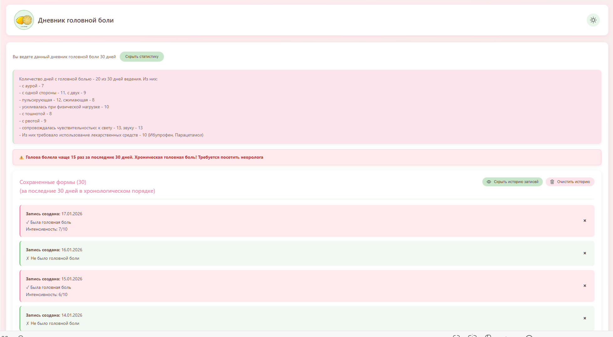
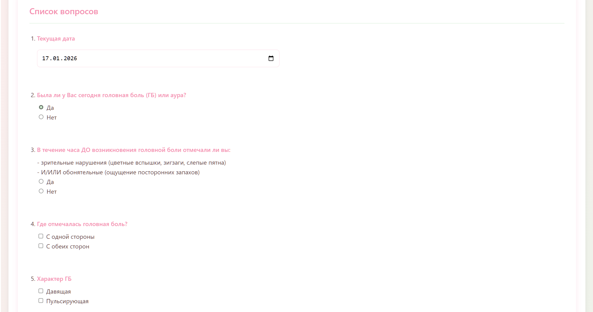
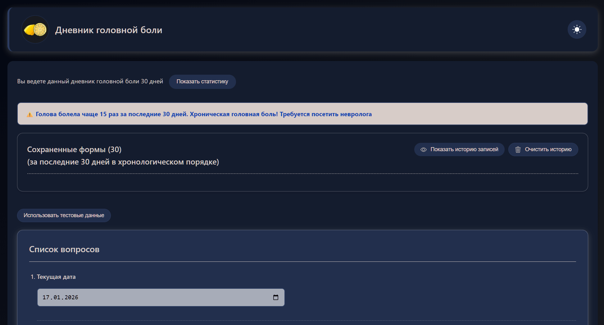

# Headache Diary / Дневник головной боли
```
Веб-приложение на Vue3 для трекинга приступов головной боли с визуализацией данных.
Портфолио-проект врача-невролога, осваивающего фронтенд.
```


## Демо

[Headache Diary] (https://183natasha-natusik-app-c0d8.twc1.net)

```
*Приложение работает полностью во фронтенде, не требует авторизации.*
```

## Цель проекта 
**Техническая:**
- Практика Vue 3 Composition API, работы с формами
- Создание полноценного SPA (Single Page Application) с нуля

**Предметная:**
- Автоматизация классического бумажного дневника головной боли
- Превращение неструктурированных записей пациента в данные для анализа врачом
- Пример того, как врачебная экспертиза меняет подход к разработке медицинских интерфейсов


## Технологический стек
**Frontend:**
- Vue 3 (Composition API)
- Логика валидации форм 
- LocalStorage для оффлайн-работы
- Адаптивный CSS (без UI-фреймворков)

**Инструменты:**
- Vite для сборки
- GitHub Actions для деплоя на Timeweb
- ESLint


## Скриншоты
Светлая тема




Темная тема



## Структура
```
├── src/
│   ├── assets/           # Компоненты Vue (логотипы)
│   ├── App.vue       # Корневой компонент
│   ├── AppCheckbox.vue, AppDate.vue, AppList.vue и др. # Компоненты Vue
│   └── main.js          # Точка входа
├── public/              # Статические файлы
├── screenshots/         # Скриншоты интерфейса
├── package.json         # Зависимости
└── index.html          # Основной HTML
```


## Функциональность
**Для пользователя (пациента):**
- Ввод детализированных данных о приступе (интенсивность, локализация, аура, принятые лекарственные средства)
- Просмотр истории всех записей
- Автоматическое сохранение данных в браузере
- Статистика и визуализация данных
- Возможно переключение между светлой/темной темой

**С медицинской точки зрения:**
- Валидация по медицинским критериям
- Алгоритм детекции риска хронической головной боли (>15 дней/месяц)
- Структура данных, соответствующая реальным клиническим параметрам (согласно клиническим рекомендациям)


## Локальный запуск
```
git clone https://github.com/183Natasha/natusik-app.git
cd natusik-app
npm install
npm run dev
```

## Планы на развитие
- Переписывание на TypeScript
- Модуль экспорта данных для врача и пациента

## Автор: 
- Наталья 
- email: 183natasha_job@mail.ru
- GitHub: [github.com/183Natasha](https://github.com/183Natasha)